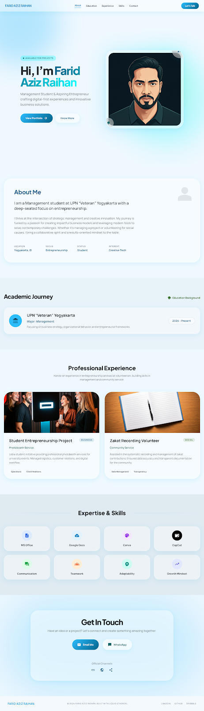

<div align="center">

# ✨ Farid Aziz Raihan — Portfolio

**A modern, premium portfolio website built for a client**

[](https://react.dev/)
[](https://vite.dev/)
[](https://tailwindcss.com/)
[](https://gsap.com/)
[](https://lenis.darkroom.engineering/)

</div>

---

## 📸 Preview

<div align="center">



</div>

---

## 📋 About This Project

This is a **client project** — a personal portfolio website built for **Farid Aziz Raihan**, a Management student at UPN "Veteran" Yogyakarta. The website showcases the client's academic background, professional experience, skills, and contact information in a visually stunning, modern interface.

The design follows the **"Liquid Ethereal"** design system — a revival of the Frutiger Aero aesthetic, reimagined through a high-end editorial lens. It emphasizes glassmorphism, atmospheric depth, and a bright, airy color palette that feels premium and futuristic.

---

## 🎨 Design Philosophy

> *"The Digital Greenhouse"* — A lush, optimistic, and hyper-tactile digital environment.

| Principle | Implementation |
|---|---|
| **Glassmorphism** | Frosted-glass cards with `backdrop-blur`, semi-transparent backgrounds, and soft ambient shadows |
| **Glossy Gradients** | Radial gradient CTAs with inner-glow highlights simulating glass edges |
| **Atmospheric Depth** | Layered, blurred orbs that create a sense of physical light and space |
| **No-Line Rule** | Structural boundaries defined through background tonal shifts — no 1px borders |
| **Organic Shapes** | High border-radius (`3rem`), rounded everything for a "pebble" feel |

### Color Palette

| Token | Hex | Usage |
|---|---|---|
| `primary` | `#006289` | Primary brand, headings |
| `primary-fixed` | `#2dbcfe` | Gradients, CTAs, orbs |
| `secondary-container` | `#0bfbff` | Accent highlights, orbs |
| `tertiary-fixed` | `#75fd00` | Decorative orbs, tags |
| `surface` | `#eff8fe` | Base background |
| `on-surface` | `#273034` | Body text |

### Typography

| Role | Font | Usage |
|---|---|---|
| Headlines & Display | **Plus Jakarta Sans** | Bold, editorial headings with tight tracking |
| Body & Labels | **Manrope** | High readability against complex backgrounds |

---

## 🚀 Tech Stack

| Technology | Purpose |
|---|---|
| **React 19** | Component-based UI architecture |
| **Vite 6** | Lightning-fast dev server and build tool |
| **TailwindCSS 3** | Utility-first styling with custom design tokens |
| **GSAP + ScrollTrigger** | Scroll-driven animations, parallax, staggered reveals |
| **Lenis** | Silky-smooth inertia scrolling |

---

## 🗂️ Project Structure

```
src/
├── App.jsx                        # Root component (Lenis + GSAP init)
├── main.jsx                       # React entry point
├── index.css                      # Tailwind directives + design system CSS
│
├── components/
│   ├── Navbar.jsx                 # Scroll-aware navbar (transparent → glass)
│   ├── BackgroundOrbs.jsx         # Ambient parallax orbs
│   └── Footer.jsx                 # Footer with social links
│
├── sections/
│   ├── Hero.jsx                   # Staggered text reveal + floating bubbles
│   ├── About.jsx                  # Glassmorphism card + stat grid
│   ├── Education.jsx              # Academic timeline card
│   ├── Experience.jsx             # Project cards with image zoom
│   ├── Skills.jsx                 # Animated skill grid
│   └── Contact.jsx                # CTA section with glow effect
│
└── hooks/
    ├── useLenis.js                # Smooth scroll initialization
    └── useScrollAnimations.js     # GSAP ScrollTrigger setup
```

---

## ✨ Features & Interactions

### 🧊 Glassmorphism System
- Semi-transparent cards with `backdrop-filter: blur(16px)`
- Ambient shadow tints using `primary` color instead of black
- "Ghost borders" at 15–30% white opacity

### 🎞️ Scroll Animations (GSAP)
- **Fade + TranslateY** — Sections smoothly reveal as they enter viewport
- **Stagger Children** — Cards and grid items animate in sequence
- **Scale Reveal** — Contact section scales up from 92% to 100%
- **Parallax Orbs** — Background orbs drift at different speeds during scroll
- **Scroll Progress Bar** — Gradient progress indicator in navbar

### 🏄 Smooth Scrolling (Lenis)
- Inertia-based scrolling with custom easing curve
- Automatic anchor link interception for seamless navigation
- `duration: 1.2` with exponential decay easing

### 🖱️ Hover Interactions
- **Cards** — `scale(1.03)` + enhanced glow shadow
- **Images** — Smooth `scale(1.08)` zoom
- **Buttons** — "Inflate" effect with scale + glow increase
- **Nav Links** — Underline grows from left on hover
- **Social Icons** — `scale(1.25)` pop

### 📱 Responsive Design
- Fully responsive grid layouts (mobile → desktop)
- Animated hamburger menu on mobile with glass dropdown panel
- Touch-optimized with Lenis `touchMultiplier: 2`

### 🧭 Navbar Intelligence
- Transparent with soft blur on page top
- Transitions to solid glassmorphic background on scroll (`>40px`)
- Includes gradient scroll progress indicator

---

## ⚡ Getting Started

### Prerequisites
- **Node.js** ≥ 18
- **npm** ≥ 9

### Installation

```bash
# Clone the repository
git clone https://github.com/Dzakiudin/Farid-Aziz-Raihan-Portofolio.git

# Navigate to project
cd Farid-Aziz-Raihan-Portofolio

# Install dependencies
npm install

# Start development server
npm run dev
```

The dev server will start at `http://localhost:5173/`

### Build for Production

```bash
npm run build
npm run preview
```

---

## 📄 Documentation

| Document | Description |
|---|---|
| [`DESIGN.md`](DESIGN.md) | Complete design system specification — colors, typography, elevation, components |
| [`product_requirements_document.md`](product_requirements_document.md) | Product requirements and feature specifications |

---

## 👤 Client

**Farid Aziz Raihan**
- 📍 Yogyakarta, Indonesia
- 🎓 Management Student — UPN "Veteran" Yogyakarta
- 🚀 Focus: Entrepreneurship & Creative Technology

---

## 📝 License

This project was built as a **client commission**. All rights to the content and branding belong to **Farid Aziz Raihan**. The codebase is available for reference and educational purposes.

---

<div align="center">

**Built with 💎 using the Liquid Ethereal Design System**

*Bright · Glassy · Futuristic · Ringan*

</div>
